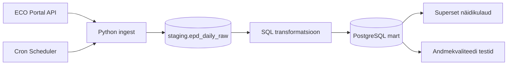

# Ehitusmaterjalide keskkonnadeklaratsioonide analüüs

Projekt ehitab andmetöövoo. Loeb ECO Portal API-st ehitusmaterjalide keskkonnadeklaratsioonid, salvestab selle PostgreSQL-i, analüüsib andmete täielikkust ja jalajälje väärtusi, kontrollib andmekvaliteeti ja näitab tulemust Superseti näidikulaual. 

## Äriküsimus

Kuidas erinevad ehitusmaterjalide keskkonnadeklaratsioonides esitatud süsiniku jalajälje väärtused erinevate toodete ja tootjate vahel ning kas andmed on piisavalt täielikud ja võrreldavad automaatseks analüüsiks? Esialgne projekti fookus armatuurterasel.

**Mõõdikud:**

1. Erinevate toodete või tootjate GWP-täieliku, GWP-fossiilse, GWP-biogeense (süsiniku jalajälje) väärtuste võrdlus ja keskmine.
2. Kui palju esineb puudulikke või ebaloogilisi EPD andmeid. Vigaste kirjete arv kogu andmebaasist - GWP-total kontroll, GWP väärtuste loogilisuse kontroll.

## Kuidas projekt täidab nõuded

| Nõue | Kuidas projekt seda täidab |
|---------|------|
| Selge äriküsimus | Keskkonnadeklaratsioonide süsinikjalajälje info usaldusväärsus |
| Ajas muutuv andmeallikas | ECO Portal API uueneb tootjate deklaratsioonide esitamisel |
| Automatiseeritud sissevõtt | scheduler konteiner käivitab töövoo croni ajakava järgi korra päevas. |
| Vähemalt üks transformatsioon | scripts/01_transform.sql loob staging andmetest mart kihi tabelid |
| Andmekvaliteedi testid | scripts/02_quality_tests.sql käivitab andmete ja jalajälje näitajate kontrollid |
| Näidikulaud | Superset rakendus näitab... |
| Saladused .env failis | Ühenduse seaded tulevad .env failist. Repos on ainult .env.example |
| README | Fail kirjeldab äriküsimust, arhitektuuri ja käivitamist |

## Arhitektuur




Täpsem kirjeldus: [`docs/arhitektuur.md`](docs/arhitektuur.md)

## Andmestik

| Allikas | Tüüp | Ajas muutuv? | Roll |
|---------|------|--------------|------|
| ECO Portal API | API | Jah, andmed uuenevad uute EPD-de lisandumisel või olemasolevate uuendamisel. Kontroll iga päev | Peamine andmeallikas |
| [Teise allika nimi] | [seed / dim-tabel] | Ei, staatiline | Kõrvaltabel |

## Stack

| Komponent | Tööriist |
|-----------|---------|
| Sissevõtt | Python |
| Transformatsioon | SQL |
| Andmehoidla | PostgreSQL |
| Näidikulaud | Superset |
| Orkestreerimine | cron |

## Käivitamine

```bash
# 1. Klooni repo ja liigu kausta
git clone <repo-url>
cd <projekti-kaust>

# 2. Kopeeri keskkonnamuutujad
cp .env.example .env
# Muuda .env failis TOKEN ja asenda SUPERSET_SECRET_KEY väärtus:
python -c "import secrets; print(secrets.token_hex(32))"

# 3. Käivita teenused
docker compose up -d --build

# 4. [Vabatahtlik: käivita sissevõtt käsitsi esimesel korral]
docker compose run --rm pipeline python scripts/run_pipeline.py rebar --init-db -y

# 5. Ava Superset
#    http://localhost:8088  (kasutaja/parool: vt .env SUPERSET_ADMIN_USER/PASSWORD)
```

Airflow (kui kasutatakse): http://localhost:8080 (kasutaja: airflow / parool: airflow)
Näidikulaud: http://localhost:[PORT]

## Saladused ja konfiguratsioon

Kõik saladused (paroolid, API võtmed, andmebaasi URL-id) on `.env` failis. Repos on ainult `.env.example`, mis näitab vajalike muutujate struktuuri ilma tegelike väärtusteta. Päris `.env` faili ei tohi GitHubi panna - see on `.gitignore`-s.

Vajalikud muutujad:

| Muutuja | Tähendus | Näide |
|---------|----------|-------|
| `DB_PASSWORD` | PostgreSQL parool | (saladus) |
| `[teised]` | ... | ... |

## Andmevoog lühidalt

1. **Sissevõtt** — [Kirjelda, kuidas andmed allikast kätte saadakse]
2. **Laadimine** — Andmed laaditakse `staging` kihti
3. **Transformatsioon** — [Kirjelda peamised arvutused ja mudelid]
4. **Testimine** — [Mitu] andmekvaliteedi testi kontrollivad korrektsust
5. **Näidikulaud** — [Kirjelda lühidalt, mida näidikulaud näitab]

## Andmekvaliteedi testid

Projekt kontrollib järgmist:

1. [Test 1 - nt: kasutajate ID on unikaalne]
2. [Test 2 - nt: tellimuse summa pole null]
3. [Test 3 - nt: kuupäev jääb vahemikku 2020-2026]
[Lisa rohkem, kui sul on]

Testide tulemused: [kuhu salvestatakse / kuidas vaadata]

## Projekti struktuur

```
.
├── README.md
├── compose.yml
├── .env.example
├── .gitignore
├── docs/
│   ├── arhitektuur.md      ← nädal 1 väljund
│   └── progress.md         ← nädal 2 väljund
└── ...                     ← ülejäänud projektifailid
```

## Kokkuvõte, puudused ja võimalikud edasiarendused

**Kokkuvõte:**
- [Loetle, mis on lõpule viidud, mis töötab hästi]

**Puudused:**
- [Loetle ausalt, mis jäi tegemata - see ei mõjuta hinnet negatiivselt, vaid aitab hinnata]

**Mis edasi:**
- [Mida tahaksid edasi teha, kui aega oleks rohkem]

## Meeskond

| Nimi | Roll |
|------|------|
| Mari Kirss | Andmeallika omanik, kvaliteedi omanik |
| Helene Abel | Tranformatsioonide omanik, näidikulaua omanik |
