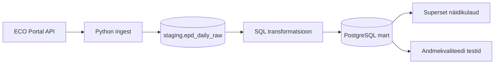

# Ehitusmaterjalide keskkonnadeklaratsioonide analüüs

Projekt ehitab andmetöövoo. Loeb ECO Portal API-st ehitusmaterjalide keskkonnadeklaratsioonid, salvestab selle PostgreSQL-i, analüüsib andmete täielikkust ja jalajälje väärtusi, kontrollib andmekvaliteeti ja näitab tulemust Superseti näidikulaual. 

## Äriküsimus

Kuidas erinevad ehitusmaterjalide keskkonnadeklaratsioonides esitatud süsiniku jalajälje väärtused erinevate toodete ja tootjate vahel ning kas andmed on piisavalt täielikud ja võrreldavad automaatseks analüüsiks? Esialgne projekti fookus armatuurterasel.

**Mõõdikud:**

1. Erinevate toodete või tootjate GWP-täieliku, GWP-fossiilse, GWP-biogeense (süsiniku jalajälje) väärtuste võrdlus ja keskmine.
2. Kui palju esineb puudulikke või ebaloogilisi EPD andmeid. Vigaste kirjete arv kogu andmebaasist - GWP-total kontroll, GWP väärtuste loogilisuse kontroll.

## Kuidas projekt täidab nõuded

| Nõue | Kuidas projekt seda täidab |
|---------|------|
| Selge äriküsimus | Keskkonnadeklaratsioonide süsinikjalajälje info usaldusväärsus |
| Ajas muutuv andmeallikas | ECO Portal API uueneb tootjate deklaratsioonide esitamisel |
| Automatiseeritud sissevõtt | Andmed loetakse sisse pipeline'i käivitamisega |
| Vähemalt üks transformatsioon | `scripts/01_transform.sql` loob `staging` andmetest `mart` kihi tabelid |
| Andmekvaliteedi testid | `scripts/02_quality_tests.sql` käivitab andmete ja jalajälje näitajate kontrollid |
| Näidikulaud | Superset rakendus näitab... |
| Saladused .env failis | Ühenduse seaded tulevad `.env` failist. Repos on ainult `.env.example` |
| README | Fail kirjeldab äriküsimust, arhitektuuri ja käivitamist |

## Arhitektuur



Andmekihid:
- staging hoiab API-st saadud lähtekuju;
- mart hoiab korrastatud keskkonnadeklaratsiooni andmeid;
- quality hoiab andmekvaliteedi testide tulemusi

Täpsem kirjeldus: [`docs/arhitektuur.md`](docs/arhitektuur.md)

## Andmestik

| Allikas | Tüüp | Ajas muutuv? | Roll |
|---------|------|--------------|------|
| ECO Portal API | API | Jah, andmed uuenevad uute EPD-de lisandumisel või olemasolevate uuendamisel. Kontroll iga päev | Peamine andmeallikas |

## Eeldused

Sammud tehakse hosti terminalis ehk selles terminalis, kus saad kasutada docker compose käsku.

Vaja on:
- Docker Desktop või muu Docker Compose keskkond;
- ligipääs internetile, et ECO Portal API-st andmeid lugeda;
- ECO Portali API Token;
- vaba port 55432 PostgreSQL-i jaoks ja 8088 näidikulaua jaoks.
Kui port on hõivatud, muuda .env failis väärtusi DB_PORT_HOST või DASHBOARD_PORT_HOST.

# Stack

| Komponent | Tööriist |
|-----------|---------|
| Sissevõtt | Python |
| Transformatsioon | SQL |
| Andmehoidla | PostgreSQL |
| Näidikulaud | Superset |

## Käivitamine

```bash
# 1. Klooni repo ja liigu eco-epd-data-pipeline kausta
git clone <repo-url>
cd eco-epd-data-pipeline

# 2. Kopeeri keskkonnamuutujad
cp .env.example .env
# Muuda .env failis TOKEN, genereeri ja asenda SUPERSET_SECRET_KEY väärtus:
python -c "import secrets; print(secrets.token_hex(32))"

# 3. Käivita teenused
docker compose up -d --build

# 4. Käivita pipeline
docker compose run --rm pipeline python scripts/run_pipeline.py run-all rebar --init-db -y --provision-superset --import-superset-assets
# Oodatav tulemus:
# - Märksõna rebar kohta 170+ vastet,
# - genereeriti .csv ja tabeli read, toimus transformatsioon
# - 2 kvaliteeditesti põrusid ("Failed") ja teised said oleku "Passed"
# - Full pipeline finished successfully

Kui Superseti dataset on millegi pärasy kadunud:
docker compose run --rm pipeline python scripts/run_pipeline.py provision-superset

# 5. Ava Superset
#    http://localhost:8088  (kasutaja/parool: vt .env SUPERSET_ADMIN_USER/PASSWORD)

# Kui sul oli sama projekt vanema skeemiga juba käivitatud, kustuta enne vana andmebaasimaht:
docker compose down -v
docker compose up -d --build
```


## Saladused ja konfiguratsioon

Kõik saladused (paroolid, API võtmed, andmebaasi URL-id) on `.env` failis. Repos on ainult `.env.example`, mis näitab vajalike muutujate struktuuri ilma tegelike väärtusteta. Päris `.env` faili ei tohi GitHubi panna - see on `.gitignore`-s.

Vajalikud muutujad:

| Muutuja | Tähendus | Näide |
|---------|----------|-------|
| `DB_PASSWORD` | PostgreSQL parool | (saladus) |
| `TOKEN` | API parool | (pikk numbrite ja tähtede jada) |
| `SUPERSET_SECRET_KEY` | Superseti võti | 32 kohaline genereeritud võti |

## Andmevoog lühidalt

1. **Sissevõtt** — [Kirjelda, kuidas andmed allikast kätte saadakse]
2. **Laadimine** — Andmed laaditakse `staging` kihti
3. **Transformatsioon** — 
4. **Testimine** — 5 andmekvaliteedi testi kontrollivad andmete korrektsust
5. **Näidikulaud** — [Kirjelda lühidalt, mida näidikulaud näitab]

## Andmekvaliteedi testid

Projekt kontrollib järgmist:

1. Test 1 - Biogeenne GWP ei tohi olla negatiivne
2. Test 2 - EPD kirjetel ei tohi puududa põhiandmed
3. Test 3 - GWP kontrollväärtus peab olema 0 või jääma 2% piiresse kogumõjust
4. Test 4 - Viimasel edukal laadimisel peab olema vähemalt üks mart-rida
5. Test 5 - Viimasel edukal laadimisel peab olema vähemalt üks staging-rida

Testide tulemused: Salvestatakse quality.test_results tabelisse ja tulemused kuvatakse pipeline'i jooksutamisel.

## Projekti struktuur

```
.
├── README.md
├── compose.yml
├── .env.example
├── .gitignore
├── docs/
│   ├── arhitektuur.md      ← nädal 1 väljund
│   └── progress.md         ← nädal 2 väljund
└── ...                     ← ülejäänud projektifailid
```

## Kokkuvõte, puudused ja võimalikud edasiarendused

**Kokkuvõte:**
- [Loetle, mis on lõpule viidud, mis töötab hästi]

**Puudused:**
- [Loetle ausalt, mis jäi tegemata - see ei mõjuta hinnet negatiivselt, vaid aitab hinnata]

**Mis edasi:**
- [Mida tahaksid edasi teha, kui aega oleks rohkem]

## Meeskond

| Nimi | Roll |
|------|------|
| Mari Kirss | Andmeallika omanik, kvaliteedi omanik |
| Helene Abel | Tranformatsioonide omanik, näidikulaua omanik |
