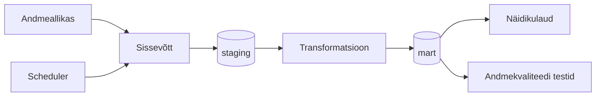

# Arhitektuur

> **Juhend:** See fail on projektitöö esimese nädala väljund. Asenda kõik nurksulgudes plankid oma projekti tegeliku sisuga. Kustuta see juhendrida.

## Äriküsimus

[Kirjuta ühe-kahe lausega oma äriküsimus täpselt. Näiteks: "Millistes kauplustes ja mis kellaaegadel on müügitõhusus (käive külastaja kohta) kõrgeim?"]

## Mõõdikud

1. [Esimene mõõdik — kirjelda, mida arvutate ja kuidas]
2. [Teine mõõdik]
3. [Kolmas mõõdik — vabatahtlik]

## Andmeallikad

| Allikas | Tüüp | Ajas muutuv? | Roll |
|---------|------|--------------|------|
| [Nimi] | [API / CSV / DB] | Jah, [iga X tundi / päeva] | [Milleks kasutatakse?] |
| [Nimi] | [seed / dim-tabel] | Ei, staatiline | [Milleks kasutatakse?] |

## Andmevoog

> Täpsusta diagrammi vastavalt oma projektile — lisa rohkem andmeallikaid, mudeleid või teenuseid.

## Andmebaasi kihid

| Kiht | Roll |
|------|------|
| `staging` | Hoiab allika andmeid töötlemata kujul. |
| `mart` | Hoiab transformeeritud ja ärilogikat sisaldavaid tabeleid. |

## Tööjaotus

| Roll | Vastutus | Täitja |
|------|----------|--------|
| Andmeallika omanik | Kirjutab sissevõtu loogika, hoiab API-t töös | [Nimi] |
| Transformatsioonide omanik | Kirjutab mart kihi mudelid ja mõõdikute arvutuse | [Nimi] |
| Kvaliteedi omanik | Kirjutab testid ja vaatab läbi ebaõnnestunud kontrollid | [Nimi] |
| Näidikulaua omanik | Ehitab näidikulaua ja seob selle äriküsimusega | [Nimi] |

## Riskid

| Risk | Mõju | Maandus |
|------|------|---------|
| [Risk 1 — näiteks: API ei vasta] | [Mis juhtub?] | [Kuidas maandad?] |
| [Risk 2] | [Mis juhtub?] | [Kuidas maandad?] |
| [Risk 3] | [Mis juhtub?] | [Kuidas maandad?] |

## Privaatsus ja turve

## Privaatsus ja turve

Projekt kasutab ECO Portali EPD andmeid, millele ligipääs toimub API kaudu vastavalt ECO Platformi kasutustingimustele. EPD dokumendid ise on avalikud dokumendid, mis sisaldavad peamiselt tootepõhist ja ettevõtetega seotud tehnilist infot ega sisalda füüsiliste isikute tundlikke isikuandmeid.
API võtmeid, andmebaasi paroole ega muid ligipääsuandmeid ei salvestata GitHubi reposse. Need hoitakse lokaalses `.env` failis, mis on lisatud `.gitignore` faili ning ei ole teistele kasutajatele avalikult kättesaadavad. Repos kasutatakse ainult `.env.example` faili näidisväljadega.
Ligipääs projektile toimub privaatse GitHubi repository kaudu ning ainult projekti liikmetele ja kursuse juhendajatele antakse ligipääs repo sisule.
