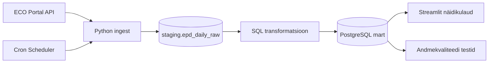

# Arhitektuur

## Äriküsimus

Kuidas erinevad ehitusmaterjalide keskkonnadeklaratsioonides esitatud süsiniku jalajälje väärtused erinevate toodete ja tootjate vahel ning kas andmed on piisavalt täielikud ja võrreldavad automaatseks analüüsiks?
Esialgne projekti fookus armatuurterasel.

## Mõõdikud

1. Erinevate toodete või tootjate GWP-täieliku, GWP-fossiilse, GWP-biogeense (süsiniku jalajälje) väärtuste võrdlus ja keskmine.
2. Kui palju esineb puudulikke või ebaloogilisi EPD andmeid. Vigaste kirjete arv kogu andmebaasist - GWP-total kontroll, GWP väärtuste loogilisuse kontroll.

## Andmeallikad

| Allikas | Tüüp | Ajas muutuv? | Roll |
|---------|------|--------------|------|
| ECO Portal API | API | Jah, andmed uuenevad uute EPD-de lisandumisel või olemasolevate uuendamisel. Kontroll iga päev | Peamine andmeallikas |

## Andmevoog

## Andmebaasi kihid

| Kiht | Roll |
|------|------|
| `staging` | ECO Platform API-st saadud algandmete salvestamine muutmata kujul |
| `intermediate` | Andmete puhastamine, normaliseerimine ja analüüsiks ettevalmistamine |
| `marts` | KPI-d, agregatsioonid ja dashboardi jaoks optimeeritud lõppandmed |

Iga pipeline'i käivitus salvestab API-st laaditud andmed staging'u kihti. Intermediate'i kihis tehakse andmete puhastamine ja transformatsioonid. Martsi kiht sisaldab dashboardi ja analüüsi jaoks optimeeritud lõpptabeleid.

## Tööjaotus

| Roll | Vastutus | Täitja |
|------|----------|--------|
| Andmeallika omanik | Kirjutab sissevõtu loogika, hoiab API-t töös | Mari Kirss |
| Transformatsioonide omanik | Kirjutab mart kihi mudelid ja mõõdikute arvutuse | Helene Abel |
| Kvaliteedi omanik | Kirjutab testid ja vaatab läbi ebaõnnestunud kontrollid | Mari Kirss |
| Näidikulaua omanik | Ehitab näidikulaua ja seob selle äriküsimusega | Helene Abel |

## Riskid

| Risk | Mõju | Maandus |
|------|------|---------|
| Sobiva tootekategooria valimine võib osutuda keeruliseks | Liiga väike või metodoloogiliselt ebaühtlane EPD valim võib piirata analüüsi kvaliteeti | Enne lõpliku skoobi valimist hinnatakse eri tootekategooriate EPD-de hulka ja andmete võrreldavust |
| Andmete kvaliteet riikide kaupa on erinev | Andmed ei ole võrreldavad | Kvaliteedikontrollid |
| EPD-l toodud andmete kogumaht on liiga suur | Andmete kättesaamine ja analüüs on liiga aeglane | Ei laadi ega kasuta kõiki andmeid, mis EPD-de pealt on võimalik lugeda |

## Privaatsus ja turve

Projekt kasutab ECO Portali EPD andmeid, millele ligipääs toimub API kaudu vastavalt ECO Platformi kasutustingimustele. EPD dokumendid ise on avalikud dokumendid, mis sisaldavad peamiselt tootepõhist ja ettevõtetega seotud tehnilist infot ega sisalda füüsiliste isikute tundlikke isikuandmeid.
API võtmeid, andmebaasi paroole ega muid ligipääsuandmeid ei salvestata GitHubi reposse. Need hoitakse lokaalses `.env` failis, mis on lisatud `.gitignore` faili ning ei ole teistele kasutajatele avalikult kättesaadavad. Repos kasutatakse ainult `.env.example` faili näidisväljadega.
Ligipääs projektile toimub privaatse GitHubi repository kaudu ning ainult projekti liikmetele ja kursuse juhendajatele antakse ligipääs repo sisule.
